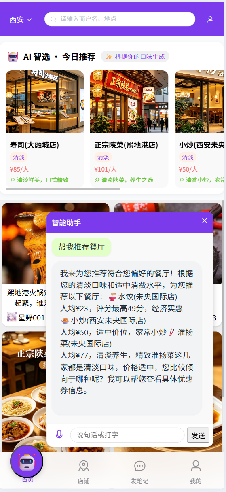
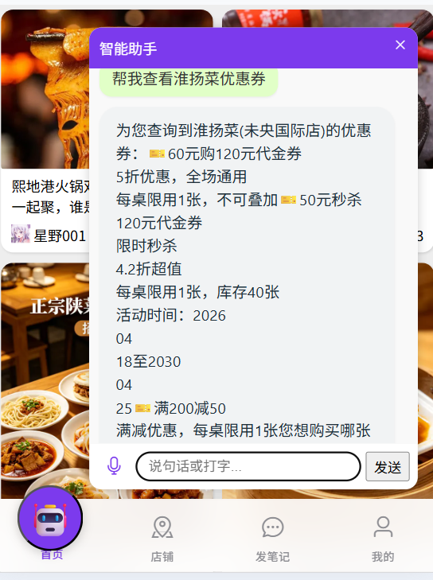
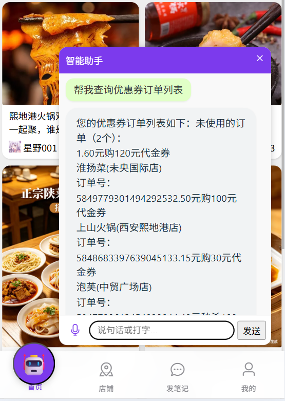
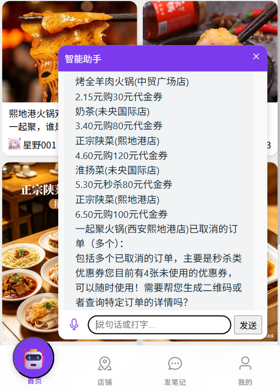
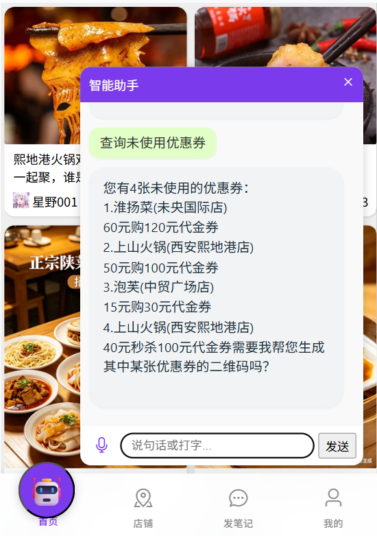
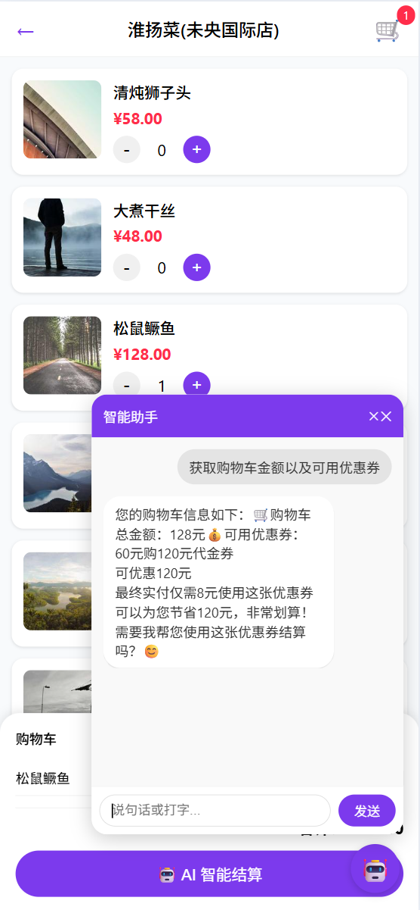
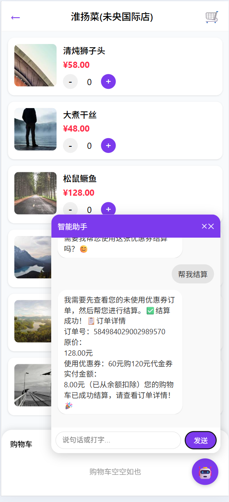
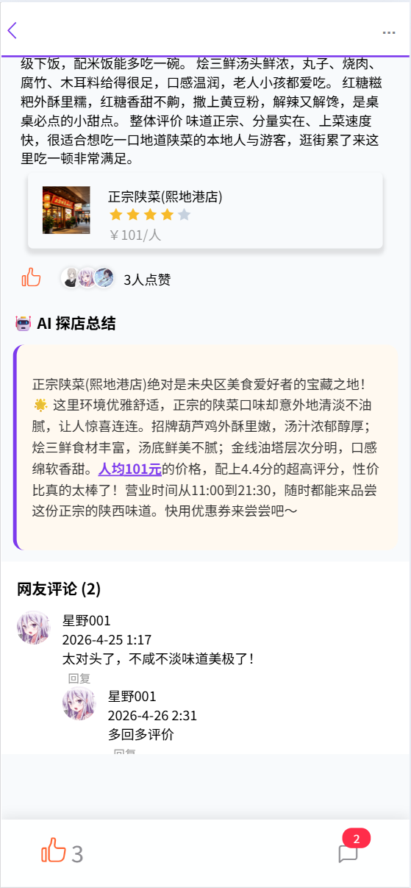

# AI Taste – 基于智谱GLM智能美食平台（后端）

[](https://spring.io/projects/spring-boot)
[](https://spring.io/projects/spring-ai)
[](https://redis.io)
[](https://mysql.com)

## 📖 项目简介

**AI Taste** 是一款基于 **智谱 GLM** 大模型的智能美食推荐与社交平台。用户可以通过自然语言与 AI 助手对话，完成店铺查询、优惠券领取、下单购买、订单核销等全流程操作。项目同时提供探店笔记、点赞评论、关注 Feed 流、购物车结算、高并发秒杀等经典社交电商功能。

后端采用 Spring Boot 3 + MyBatis-Plus + Redis + Spring AI 架构，独立设计并实现了：
- ✅ **AI 对话式导购**（流式 SSE + Function Calling）
- ✅ **高并发秒杀系统**（Lua + Redis Stream + Redisson 锁）
- ✅ **多级缓存**（逻辑过期 + 布隆过滤器 + AI 热点预热）
- ✅ **推模式 Feed 流**（Redis ZSet + 滚动分页）
- ✅ **用户画像**（Redis Hash + MySQL 异步同步）

---

## ✨ 项目展示

<div align="center">
  <p><strong>首页</strong></p>
  
</div>

<div align="center">
  <p><strong>AI查询推荐店铺列表</strong></p>
  
</div>

<div align="center">
  <p><strong>AI查询店铺优惠券</strong></p>
  
</div>

<div align="center">
  <p><strong>AI购买指定优惠券</strong></p>
  
</div>

<div align="center">
  <p><strong>AI生成优惠券二维码</strong></p>
  
</div>

<div align="center">
  <p><strong>AI查询已购买的优惠券订单1</strong></p>
  
</div>

<div align="center">
  <p><strong>AI查询已购买的优惠券订单2</strong></p>
  
</div>

<div align="center">
  <p><strong>AI查询已购买的优惠券订单3</strong></p>
  
</div>

<div align="center">
  <p><strong>AI取消优惠券订单</strong></p>
  
</div>

<div align="center">
  <p><strong>AI获取当前购物车以及用户可用优惠券</strong></p>
  
</div>

<div align="center">
  <p><strong>AI结算当前购物车</strong></p>
  
</div>

<div align="center">
  <p><strong>博客详情页</strong></p>
  
</div>

## 🛠 技术栈

| 类别           | 技术                                                          |
| -------------- | ------------------------------------------------------------- |
| 框架           | Spring Boot 3, Spring MVC, MyBatis-Plus, Spring AI            |
| AI 模型        | 智谱 GLM (ZhipuAI) – 通过 `spring-ai-starter-model-zhipuai` 集成 |
| 数据库         | MySQL 8.0, 阿里云 OSS                                         |
| 缓存/中间件    | Redis (Redisson, Stream, Geo, BloomFilter)         |
| 工具           | Maven, Git, JMeter, IDEA Database, RESP                       |

---

## 🚀 核心亮点

### 1️⃣ 智谱 GLM 全流程集成（对话即服务）

- 基于 **Spring AI** 封装 `ChatClient`，注册 **8 个 `@Tool`**（查店铺、领券、下单、购物车结算等），实现自然语言驱动的业务调用。
- 使用 **WebFlux `Flux<String>` + SSE** 实现流式对话，首字延迟 < 300ms。
- 从 Redis 读取**用户画像**（口味、消费等级、常去区域）动态构建系统提示词，让 AI 回答更个性化。
- **AI 热点预测**：每 5 分钟聚合店铺访问日志，调用 GLM 预测未来热点店铺 ID，主动刷新缓存，命中率提升约 25%。

### 2️⃣ 高并发秒杀 + 多级缓存

- **秒杀**：Lua 脚本原子扣库存 + 判重；订单异步处理（Redis Stream + 消费者组）；Redisson 分布式锁防超卖；取消订单自动回滚库存和防重复 Set。
- **缓存**：逻辑过期 + 线程池异步刷新解决击穿；Redisson 布隆过滤器防穿透；启动全量预热 + AI 动态刷新。  
  压测结果：秒杀 QPS 提升 3~4 倍，数据库压力降低 70%。

### 3️⃣ 社交互动与 Feed 流

- 点赞：`blog:liked:{blogId}` ZSet 存储用户 + 时间戳，支持前 5 名展示和取消点赞。
- 评论：树形嵌套 + 批量用户信息填充，避免 N+1。
- Feed 流：推模式，关注用户笔记推送至收件箱（ZSet），游标分页 `lastId + offset`，响应 < 80ms。

### 4️⃣ 工程化设计

- 自研 `RedisIdWorker`（时间戳 + Redis 日序列）生成全局唯一订单号。
- 封装 `CacheClient` 统一处理逻辑过期、空值缓存、互斥锁。
- `TokenAuthenticationFilter` 整合 Spring Security + Redis 实现无状态登录。

---

## 📁 项目结构（后端）
src/main/java/com/AITaste/

├── config/ # 配置类 (亮点：AIConfig、RedissonConfig)

├── controller/ # RESTful 接口（AI、博客、购物车、订单、优惠券等）

├── dto/ # 数据传输对象

├── entity/ # 数据实体

├── mapper/ # MyBatis-Plus Mapper

├── service/ # 业务接口定义（IUserService, IVoucherOrderService等）

│   └── impl/ # 业务接口实现类（UserServiceImpl, VoucherOrderServiceImpl等）

├── utils/ # 工具类（AITools, CacheClient, RedisIdWorker, UserHolder, RedisConstants等）

├── VO/ # 视图对象，用于接口返回

└── AITasteApplication.java


---

## ⚡ 快速启动（本地运行）

### 环境要求
- JDK 17
- Maven 3.8+
- Redis 7.0（需开启 Stream 支持）
- MySQL 8.0

### 配置文件
修改 `application.yaml` :
```yaml
spring:
  datasource:
    url: jdbc:mysql://localhost:3306/aitaste?useSSL=false&serverTimezone=Asia/Shanghai
    username: root
    password: your_password
  redis:
    host: localhost
    port: 6379
  ai:
    zhipuai:
      api-key: your_zhipuai_api_key   # 从智谱开放平台获取

aliyun:
  oss:
    endpoint: oss-cn-hangzhou.aliyuncs.com
    bucket-name: your-bucket
    custom-domain: https://your-domain
```

### 配置步骤

1. **克隆仓库**
   ```bash
   git clone https://github.com/wangsizhe-cmdbit/AITaste.git
   cd AITaste
   ```
2. **申请智谱 GLM API Key**
   ```bash
   访问 智谱开放平台 注册并获取 api-key.
   ```
3. **修改 application.yaml 或设置环境变量（需自行创建)**
```yaml
spring:
  datasource:
    url: jdbc:mysql://localhost:3306/aitaste?useSSL=false&serverTimezone=Asia/Shanghai
    username: root
    password: your_password
  redis:
    host: localhost
    port: 6379
  ai:
    zhipuai:
      api-key: your_zhipuai_api_key

aliyun:
  oss:
    endpoint: oss-cn-hangzhou.aliyuncs.com
    bucket-name: your-bucket
    custom-domain: https://your-domain   
```
4. **初始化数据库**
   ```bash
   执行 aitaste.sql创建表结构.
   ```
5. **启动 Redis 和 MySQL。**
6. **运行项目。**
   ```bash
   mvn clean spring-boot:run
   ```
注意：因涉及第三方 API Key 和私有云配置，本仓库不包含完整配置文件。如需完整运行，请根据上述步骤自行配置。

## 📮 核心 API 示例

### 1.AI 流式对话
    POST /ai/chat
    Content-Type: application/json

    {
      "query": "附近有什么川菜馆？人均50左右",
      "sessionId": "test_123",
      "context": {"shopId": null},
      "x": 116.397128,
      "y": 39.916527
    }
   
响应：text/event-stream 分段推送。

### 2.秒杀优惠券
    POST /voucher-order/order/{voucherId}
    Authorization: {token}

### 3.发布探店笔记
    POST /blog
    Authorization: Bearer {token}
    Content-Type: application/json

    {
    "title": "宝藏日料店",
    "content": "...",
    "images": "https://oss...",
    "shopId": 18
    }

### 4.查询 Feed 流
    GET /blog/of/follow?lastId=0&offset=0
    Authorization: {token}

响应：滚动分页的笔记列表。

## 🧪 压测与监控

- **JMeter 压测**：使用 `docs/seckill.jmx` 脚本模拟高并发秒杀场景，验证库存扣减、重复下单拦截以及接口吞吐量。
- **缓存命中率监控**：通过 Redis 命令 `INFO stats` 查看 `keyspace_hits` 和 `keyspace_misses`，计算命中率 = hits / (hits + misses)。
- **日志监控**：`logs/` 目录下记录 AI 调用、订单异步处理、定时任务执行详情，便于问题排查。

## 📄 开源说明

本项目为个人求职作品，仅供学习交流。部分配置（API Key、OSS 密钥）已剔除，如需完整部署请联系作者。

作者：wsz
邮箱：2365792676@qq.com
GitHub：https://github.com/wangsizhe-cmdbit/AITaste


